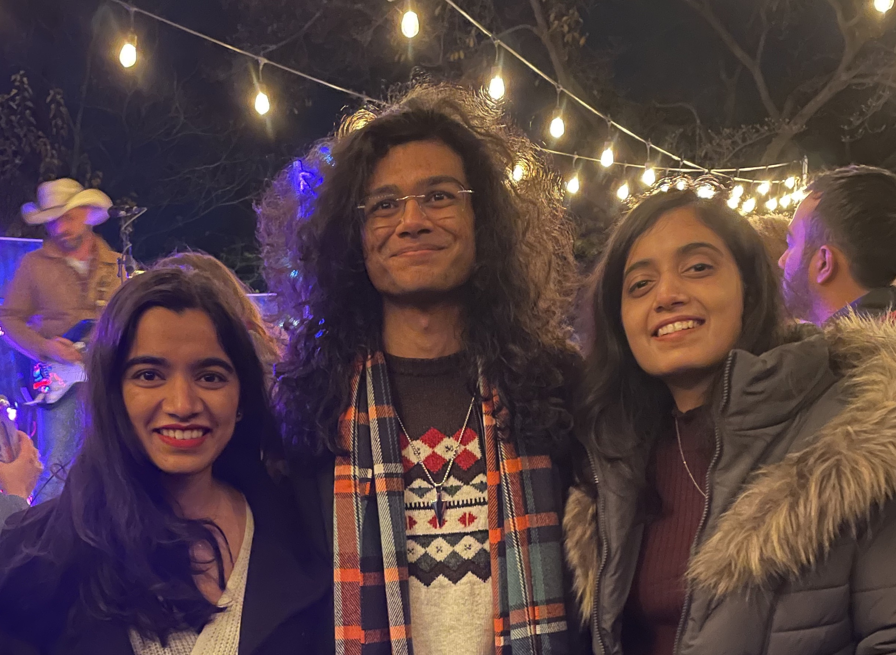

## Identifying Likely-Infected Nodes and Reconstructing the Infection Trace for COVID-19

Meet the team! (Vidushi, Abhinav, and Kasturi from L-R)

### About the project

As a part of the course CSE 8803, we undertook the task of indentifying missed infections in the reported cases of COVID spread across Singapore and Korea. The choice of the countries of study was decided on the basis of data available. Singapore and Korea had extensively monitored the spread of COVID and systematically recorded and released relevant data. The Singapore dataset can be found here: [Singapore Dataset](https://www.againstcovid19.com/singapore/dashboard) and the Korea Dataset can be found here: [Korea Dataset](https://www.kaggle.com/kimjihoo/coronavirusdataset). 

We utilised two state of the art algorithms towards this end: [NETFILL](https://epubs.siam.org/doi/pdf/10.1137/1.9781611974010.47) and [CuLT](https://dl.acm.org/doi/pdf/10.1145/2939672.2939865). We were able to successfully reconstruct the spread of COVID in Korea using CuLT very accurately. We were also able to find cuplrit and missed infections in small cliques of infections taken from the Singapore dataset using NETFILL. To find the details of the experiments and inferences made on the calculated outputs, please refer to the [Report]() or [Presentation]() of the talk given in class. 

### Support or Contact

If you have any questions regarding our work feel free to reach out to us or open issues in the repository!
